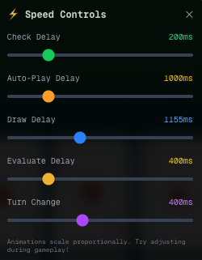

# card-state-machine

A state machine architecture for a turn-based card game system using XState v5.

## Overview

This project implements a turn-based card matching game where 2-4 players compete to match cards by rank to a discard pile. The goal is to be the first to discard all cards or to finish with the lowest hand value when the round timer expires.

## Game Mechanics

*   **Objective**: Be the first to discard all your cards, or have the lowest total hand value when the 3-minute round timer expires.
*   **Card Play**: Match cards by rank to the top card of the shared discard pile. If you cannot play a match, you must take another card from the deck.

### Scoring System

- Ace = 1 point
- Number cards (2-10) = Face value
- Jack = 11 points
- Queen = 12 points
- King = 13 points

Standard 52-card deck in play.

### Game Setup

- **Players**: 2–4 (prompted at start)
- **Initial Deal**: Each player receives 5 cards
- **Starting Card**: One additional card is revealed to seed the discard pile
- **First Player**: Randomly selected
- **Timer**: A 3-minute round timer limits play

### Turn Loop

1. **Selecting** – If multiple cards match the top discard rank, the player can select/deselect those cards and press SPACE/“Play Selected” to place one or more matching cards on the discard pile.
2. **Auto-play** – If the active player has exactly one card that matches the rank of the top discard card, it is played automatically.
3. **Drawing** – If no matching cards exist, the player draws one card from the deck. The turn then advances to the next player; the player cannot play the newly drawn card in the same turn.

This loop repeats in player order until a hand empties, the timer expires, or the deck runs out.

### Controls

- Click a card to select/deselect it when the machine is in the `selecting` state.
- Press SPACE (or the “Play Selected” button) to play the selected cards.
- Auto-play runs without input whenever only one valid card exists.

### State Chart Outline

```
cardGame
├─ setup (on game.start → roundActive)
├─ roundActive (timer actor; on timer.expired → roundEnd)
│  ├─ playing (active gameplay; on round.pause → paused)
│  │  └─ playerTurn (turn sequence loop)
│  │     ├─ checkingCards (after CHECKING_DELAY* → guard routing)
│  │     ├─ autoPlaying (after AUTO_PLAY_DELAY* → evaluating + autoPlaySingleCard)
│  │     ├─ selecting (no delay; user selects/plays)
│  │     ├─ drawing (after DRAW_DELAY* → evaluating)
│  │     ├─ evaluating (after EVALUATING_DELAY* → roundEnd or changingTurn)
│  │     └─ changingTurn (after TURN_CHANGE_DELAY* → checkingCards)
│  └─ paused (on round.resume → history)
└─ roundEnd (entry calculateScores; on round.start → roundActive; on game.over → setup)

* All delay constants configurable via timing.update event (see context.timing)
```

## Timing Architecture

All timing delays are configurable parameters (stored in `context.timing`) with defaults from `/lib/constants.ts`. Adjust them in the Speed Controls UI in-app: 



TLDR - I went deep in the Xstate rabbit hole and decided to leave in my debugger. But it's pretty useful for getting the look and feel down for a game.

**Design Principle:**
- State machine delays define **state duration** (how long a state lasts)
- Animations read these constants and **fill the available window**
- As long as `animation duration ≤ state duration`, the system works correctly
- Animations dynamically adjust their timing when state durations change (see `/lib/animations/cardAnimations.ts`)

| State            | Purpose                                                  | Default Duration (ms) |
| ---------------- | -------------------------------------------------------- | --------------------- |
| checkingCards    | Checks for stalemate, then decides next action based on available cards | 200                   |
| autoPlaying      | Shows auto-play animation for single matching card       | 1000                  |
| drawing          | Shows card draw animation from deck to hand              | 1155                  |
| evaluating       | Checks if current player won and clears card animations  | 400                   |
| changingTurn     | Highlights next player                                   | 400                   |

This is **time-based coordination** (not event-driven). The state machine is the clock - it doesn't wait for animations to signal completion. See `docs/ARCHITECTURE.md` for detailed timing decisions.

## State Machine Schema

### Context
<details>
<summary>Show details</summary>

- `players`: Array of `{ id, name, hand, score }`
- `currentPlayerIndex`: Index of active player
- `deck`: Remaining draw pile
- `discardPile`: Cards that have been played
- `selectedCards`: Currently highlighted cards (one or more)
- `roundScores`: Final scores recorded at round end
- `timing`: Configurable state durations

**Note:** Timer state (`remainingMs`, `startMs`) lives in the timer machine actor, not in game context.

</details>

### States
<details>
<summary>Show details</summary>

- `setup`: Await `game.start`
- `roundActive`
  - `playing`
    - `playerTurn`
      - `checkingCards`: fast decision routing (default: 200ms)
      - `autoPlaying`: dedicated auto-play animation state (default: 1000ms)
      - `selecting`: player chooses matching cards (multi-card selection supported)
      - `drawing`: forced draw animation (default: 1155ms)
      - `evaluating`: check win condition or continue (default: 400ms)
      - `changingTurn`: advance to next player (default: 400ms)
    - `hist`: history state for pause/resume
  - `paused`: game paused, timer frozen
- `roundEnd`: Scores calculated, can restart round or end game

</details>

### Events
<details>
<summary>Show details</summary>

**External Events:**
- `game.start` - User starts a new game
- `round.start` - User starts a new round (keeps players, resets deck)
- `game.over` - User ends game, returns to setup
- `card.select`, `card.deselect` - User selects/deselects cards
- `card.play` - User plays selected cards (SPACE key)
- `round.pause`, `round.resume` - User pauses/resumes game
- `timer.expired` - Timer machine notifies when time's up
- `timing.update` - Dynamic timing configuration updates

**Note:** Decision logic (auto-play vs manual selection) is now handled by guards in `checkingCards`, not internal events.

</details>

### Guards
<details>
<summary>Show details</summary>

- `canPlaySelectedCards`: All selected cards match top discard rank
- `currentPlayerHasNoCards`: Active player's hand is empty (win condition)
- `hasMultipleValidCards`: Player has 2+ cards matching top discard
- `hasSingleValidCard`: Player has exactly 1 card matching top discard
- `deckEmpty`: Used when the draw pile is empty. This may lead to a turn skip.
- `isStalemate`: A more specific check for when the deck is empty AND no player can make a valid move. This ends the round.

</details>

### Key Transitions
<details>
<summary>Show details</summary>

- `setup` --`game.start`--> `roundActive`
- `checkingCards` --after `CHECKING_DELAY` + guards-->
  - `isStalemate` → `roundEnd` (deck empty, no one can play)
  - `hasMultipleValidCards` → `selecting`
  - `hasSingleValidCard` → `autoPlaying`
  - `deckEmpty` → `changingTurn` (skip turn, someone else might play)
  - default → `drawing`
- `autoPlaying` --after `AUTO_PLAY_DELAY` + `autoPlaySingleCard`--> `evaluating`
- `drawing` --after `DRAW_DELAY`--> `evaluating`
- `evaluating` --`currentPlayerHasNoCards`--> `roundEnd`
- `evaluating` --else--> `changingTurn`
- `roundEnd` --`round.start`--> `roundActive` (same players)
- `roundEnd` --`game.over`--> `setup` (full reset)
- `changingTurn` --after `TURN_CHANGE_DELAY` + `advanceTurn`--> `checkingCards`
- `roundActive` --`timer.expired`--> `roundEnd`

</details>

### Actions
<details>
<summary>Show details</summary>

- `initializeGame`, `restartRound`, `resetGame`
- `selectCard`, `deselectCard`, `playSelectedCards`, `autoPlaySingleCard`, `drawCard`, `advanceTurn`
- `forwardPauseToTimer`, `forwardResumeToTimer`, `calculateScores`, `updateTimingConfig`

</details>

## Machines

This app uses two XState machines:
- `machines/cardGameMachine.ts` orchestrates gameplay and invokes the timer actor.
- `machines/timerMachine.ts` owns round timing and emits `timer.expired`.

Pure helpers live in `lib/cardGameLogic.ts` (game rules/reducers) and `lib/timerHelpers.ts` (timer actor accessors).

## Architectural Decisions
Xstate gives you a ton (and sometime frustrating amount) of flexibility on modeling state. So I'm noting a few key decisions/rewrites that I did over the journey:
### 1. Time-Based Pacing over Event-Based Coordination

**Problem:** Initial versions of the machine executed state transitions instantly, causing a "cascade" where multiple turns could happen in milliseconds without the UI updating.

**Solution:** We chose a "pragmatic delays" approach, using XState's `after` delays to create observable states. The state machine acts as the "clock," and UI animations are subordinate to its timing. This provides consistent, predictable pacing without the complexity of a fully event-driven system where the UI would need to send `animation.complete` events back to the machine. This decision is detailed further in `docs/ARCHITECTURE.md`.

### 2. Guard-Based Routing over Internal Events

**Problem:** Decision-making (e.g., auto-play vs. manual selection vs. drawing) could be modeled in several ways. An early version used an intermediate `readyToAct` state that would `raise()` internal events.

**Solution:** The machine was refactored to use a more direct and declarative pattern. The `checkingCards` state now uses a prioritized list of guarded transitions. The Stately UI builder thing doesn't love it, but it's far more readable.

### 3. Dedicated Timer Actor

**Problem:** Timer logic and game logic are separate concerns. While easily done in a monoloth, mixing them in the same machine ultimatley felt cluttered.

**Solution:** Separated into `timerMachine` and `gameMachine` and while I was at it I added pause/play. The main game machine invokes this actor and only listens for a single `timer.expired` event. All timer-related state (remaining time, pause state) is owned exclusively by the timer actor.

**Deep Dive - Why This Approach:**

**Why a Separate Machine (not `fromCallback`):**
- Timer has distinct lifecycle states: `running`, `paused`, `expired`
- Pause/resume requires complex time tracking (accumulating pause duration, recalculating start time)
- State machine visualization makes timer logic inspectable and debuggable
- Better demonstrates XState v5 actor composition patterns for code review

**Why `invoke` (not `spawn`):**
- **Automatic lifecycle**: Timer created on `roundActive` entry, destroyed on exit
- **Declarative**: State definition shows what actors exist at any given time
- **No memory leaks**: XState handles cleanup automatically
- **Correct semantics**: Timer lifetime is coupled to `roundActive` state - when the round ends, the timer should cease to exist

**Why `input` for `parentRef` (not events):**
- **Initialization data**: Parent reference needed from the moment timer is created
- **No race conditions**: Parent ref available immediately, before any events could be processed
- **Type safety**: `parentRef` is never nullable in timer context
- **Cleaner code**: No event handling boilerplate just to initialize a reference

**Why `sendTo` (not `sendParent`):**
- XState v5 best practice: explicit actor references preferred over implicit parent lookup
- Type-safe: TypeScript knows exactly what events the parent accepts
- More flexible: Same actor could notify multiple targets if needed
- Future-proof: `sendParent` is a convenience pattern, `sendTo` is the foundational primitive

**Why `syncSnapshot: true` is Critical:**
- **React observes snapshots, not events**: `useSelector` hook subscribes to actor snapshots
- **Child updates don't propagate by default**: Timer's `remainingMs` changes every second, but parent snapshot wouldn't update
- **Without it**: Timer ticks internally but UI freezes (parent snapshot stale)
- **With it**: Every timer tick creates new parent snapshot → `useSelector` fires → React re-renders

**Pause/Resume Behavior:**
- Uses XState history states (`hist: { type: 'history', history: 'deep' }`)
- Resuming restores state path but restarts `after` delays from scratch
- **Trade-off accepted**: For short game animations (200-1000ms), restarting delays is acceptable
- Alternative would require complex elapsed-time tracking in every state's context

This architecture demonstrates production-ready XState v5 patterns: actor composition, explicit communication via `sendTo`, proper lifecycle management with `invoke`, and React integration via `syncSnapshot`.

## Tech Stack

- **State Management**: XState v5 (Actor Model)
- **Framework**: Next.js 16+ with App Router
- **Runtime**: Bun
- **Language**: TypeScript 5+
- **Styling**: Tailwind CSS v4
- **Animations**: Framer Motion

## Getting Started

```bash
# Install dependencies
bun install

# Run development server
bun run dev

# Build for production
bun run build
```

## Documentation

- `docs/XSTATE_DOCS.md` - XState v5 reference for context
- `machines/cardGameMachine.ts` - Main game state machine implementation
- `machines/timerMachine.ts` - Round timer actor machine
- `lib/cardGameLogic.ts` - Pure game rules and reducers
- `lib/timerHelpers.ts` - Timer actor accessors
- `docs/` for more agent notes & V5 examples I worked off

## Terminology: "Round" vs "Game"

**Domain Model (Code)**: Uses "round" terminology per requirements document
- State names: `roundEnd`, `roundActive`
- Events: `round.start`, `round.pause`, `round.resume`
- Comments and docs reference "round timer", "round scores"
- Test files use "round" language

**User Interface**: Uses "game" terminology for clarity
- "Game Over!" (not "Round Over!")
- "Play Again (same setup)" - rematch with same players
- "Back to Menu" - return to setup screen

**Rationale**: while making this I tried wiring up versions that have multiple rounds and multi-round scoring, and that's the logical direction for making a more fun game. But I pared it all back to keep it simple per the ask.

## My notes on it

Xstate is a convenient single source of truth - I definitely see the appeal for complex UI flows. It does seems intuitive that you have one ironclad skeleton for state and everything else subscribed to it.

Keeping UI and state separate seemed like the main idea from the videos I watched. (Interestingly, the guy said Stately's UI formatter was bad, but I found it helpful at first to double check logic directions - tho it gets worse with v5 syntax). Going deeper I started to see where devs might add bi-directional plumbing (eg ui.animationComplete) that updates state machine.

I will say it seems like Stately's stuff is all 2 years+ old and code examples beyond their official docs are scant. But I think it's worth the difficulty and I might incorporate into my own projects.

## Other / possible directions
- it's not technically possible to discard all your cards with 5 dealt cards, so we'd need a rule change to add the the discards
- multi round is way more fun/cool (I tried it out and then pared it back)
- if we add more complexity it might make sense to make Players to be Actors